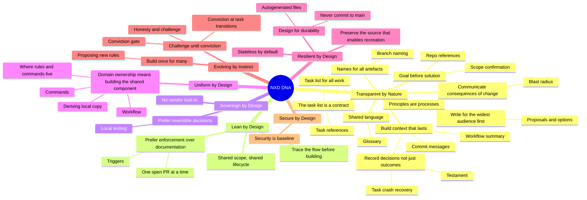

# NXD DNA — Hierarchy Diagram

```mermaid
mindmap
  root((NXD DNA))
    Transparent by Nature
      Principles are processes
      Goal before solution
        Scope confirmation
        Repo references
      Build context that lasts
        Commit messages
        Workflow summary
        Record decisions not just outcomes
          Task crash recovery
          Testament
      The task list is a contract
        Task list for all work
        Task references
      Communicate consequences of change
        Blast radius
      Names for all artefacts
        Branch naming
      Write for the widest audience first
        Proposals and options
      Shared language
        Glossary
    Lean by Design
      Shared scope, shared lifecycle
      Prefer enforcement over documentation
        Triggers
        One open PR at a time
      Trace the flow before building
    Sovereign by Design
      No vendor lock-in
      Prefer reversible decisions
        Local testing
    Uniform by Design
      Domain ownership means building the shared component
        Where rules and commands live
        Workflow
        Deriving local copy
        Commands
    Resilient by Design
      Preserve the source that enables recreation
      Design for durability
        Never commit to main
        Autogenerated files
      Stateless by default
    Evolving by Instinct
      Challenge until conviction
        Honesty and challenge
        Conviction gate
        Conviction at task transitions
      Build once for many
        Proposing new rules
    Secure by Design
      Security is baseline
```