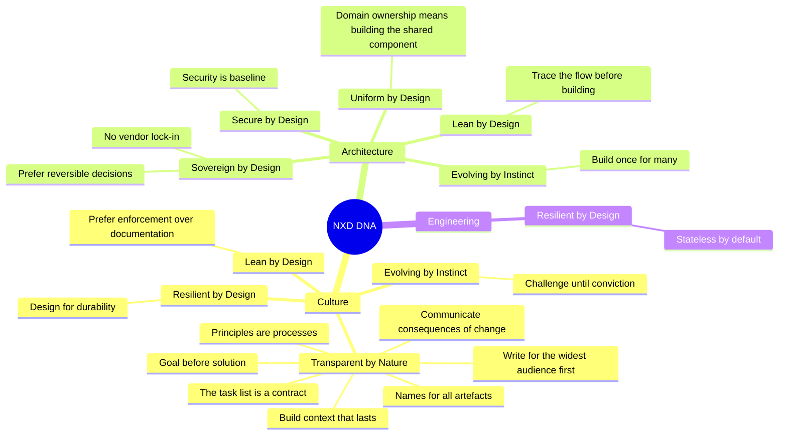

# NXD DNA — Hierarchy Diagram

```mermaid
mindmap
  root((NXD DNA))
    Culture
      Transparent by Nature
        Principles are processes
        Goal before solution
        Build context that lasts
        The task list is a contract
        Communicate consequences of change
        Names for all artefacts
        Write for the widest audience first
      Lean by Design
        Prefer enforcement over documentation
      Resilient by Design
        Design for durability
      Evolving by Instinct
        Challenge until conviction
    Architecture
      Lean by Design
        Trace the flow before building
      Sovereign by Design
        No vendor lock-in
        Prefer reversible decisions
      Uniform by Design
        Domain ownership means building the shared component
      Evolving by Instinct
        Build once for many
      Secure by Design
        Security is baseline
    Engineering
      Resilient by Design
        Stateless by default
```